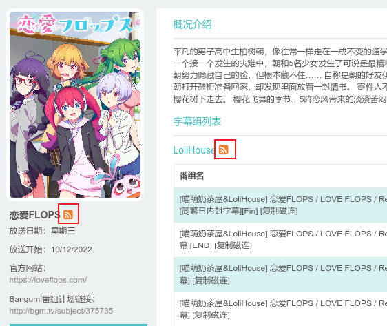

<h1 align="center">
  Alist-MikananiRss
</h1>
<p align="center">
  从<a href="https://mikanani.me/">蜜柑计划</a>的RSS订阅源中自动获取番剧更新并通过Alist离线下载至对应网盘
</p>  

## 准备工作 
1. 请自行参照[Alist](https://github.com/alist-org/alist)项目文档部署Alist，并搭建好Aria2离线下载
2. 获取RSS订阅链接，本项目仅支持番剧的订阅链接，如下图所示，整个番剧/番剧下的单个字幕组链接均可，多个字幕组可能需要获取多个链接。（强行用账户订阅链接也可，只是无法根据不同番剧下载到不同文件夹）


## 如何使用
1. 下载源码
```shell
git clone https://github.com/TwooSix/Alist-MikananiRss.git && cd Alist-MikananiRss
```
2. 安装依赖
```shell
pip install -r requirements.txt
```
3. 在目录下新建一个`config.py`配置文件，并填写配置文件，具体填写示例见`example.py`
	 - `domain`：字符串，你的alist部署域名，如`www.example.com`
	 - `username`, `password`：字符串，你的Alist账户密码
	 - `downloadPath`：字符串，你的下载文件夹，从登陆用户的根目录开始，如`AliyunPan/Anime`
	 - `rssFilter`：字典，你的正则表达式规则，填写方式为`{name: regex}`（当然也可以复制用我写的），如`{"1080": r"(1080[pP])}"`
	 - 在`rss`字段填写番剧的RSS订阅（非个人账户的总订阅）
		- `url`：字符串，从[蜜柑计划](https://mikanani.me/)获取的RSS订阅链接
		- `filter`：字符串列表，用于当前rss订阅源的正则表达式过滤规则，填写规则名字即可，如`["1080"]`
		- `subfolder`：字符串，下载的子文件夹名，决定是否单独存放到子文件夹
			- 不填则默认下载到`downloadPath`
			- 填写则下载到`downloadPath/subfoler`
			- 填写`__AUTO__`时程序会尝试自动获取番剧名并存放到番剧名对应子目录，若获取失败则存放至`downloadPath`

4. 运行代码`python main.py`
5. Enjoy
