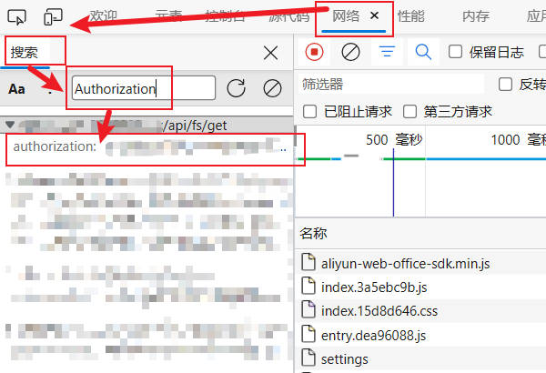

# Alist-MikananiRss
## 快速开始
### 获取管理员Token
1. 登入你部署的Alist
2. 按出F12控制台，刷新页面
3. 在`网络->搜索`处搜索`authorization`，随便挑一个即可
	
### 部署
1. 下载源码
```shell
git clone https://github.com/TwooSix/Alist-MikananiRss.git
```
2. 安装依赖
```shell
cd Alist-MikananiRss && pip install -r requirements.txt
```
3. 在`Config.py`文件编写配置文件
	 - 在`domain`字段填写你的alist部署域名，示例`www.example.com`
	 - 在`token`字段填写你的管理员token
	 - 在`downloadPath`字段填写你的下载文件夹，示例`AliyunPan/Anime`
1. 修改`main.py`文件
		修改`rssList`，改为你自己的RSS订阅
	- RSS(url, filter, subfolder=None)
		- url：你从蜜柑计划获取的RSS链接
		- filter：通过正则表达式过滤结果，目前我只个人内置了'简体'，'繁体'，'1080'，'非合集'四种，写的也比较粗糙
		- subfoler：子文件夹名，决定是否单独存放到子文件夹，**应该需要提前在路径下创建好文件夹**，不填则默认下载到`downloadPath`，填写则下载到`downloadPath/subfoler`
		具体填写示例查看main.py文件即可
4. 运行代码`python main.py`
5. Enjoy