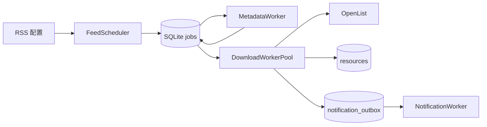
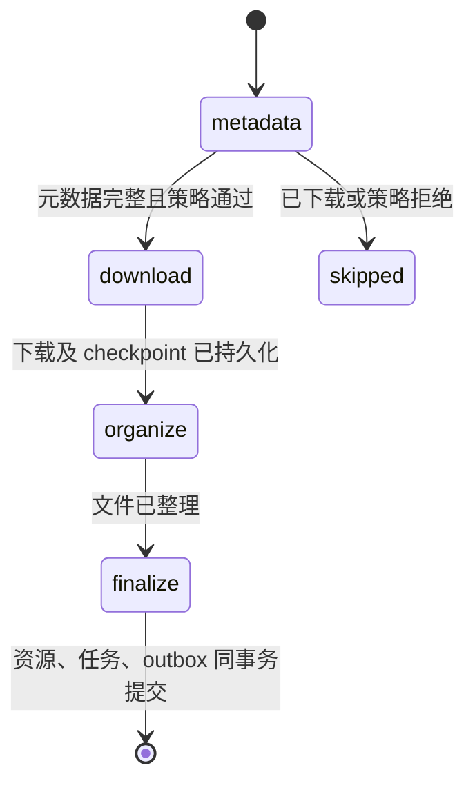

# 核心业务架构

## 目标与边界

核心业务采用单进程异步模块化单体。SQLite 是任务状态的唯一真相来源；内存只保存单次领取的有界批次和用于降低轮询延迟的 `asyncio.Event`。本轮不改变 `assistant`、内置 skills 和消息集成，只维持它们依赖的 HTTP 接口、`data/data.db` 路径及 `resources` 旧列。

依赖方向固定为：

```text
domain <- application <- adapters <- bootstrap
```

- `domain`：发布、元数据、任务状态和命名规则，不访问网络或数据库。
- `application`：Scheduler、worker 和 HTTP 用例，只依赖 `ports.py` 中的窄协议。
- `adapters`：RSS、TMDB、OpenList、通知、SQLite 和 HTTP 的具体实现。
- `bootstrap`：唯一组合根，创建资源、注册内置适配器并管理进程生命周期。

旧的通用 Pipeline、多级内存队列、事件总线和分散 Registry 已删除。唯一注册中心是 `adapters/registry.py`，它只负责启动时显式装配内置实现，不进行运行时扫描。

## 运行流程



1. Scheduler 分别调度订阅，保存 ETag、Last-Modified、下次执行时间和单订阅退避状态。
2. 候选项按 `guid`、下载 URL、或来源 URL 与标题哈希生成稳定幂等键；repository 还会跨 RSS 来源按下载 URL 去重。
3. MetadataWorker 原子领取最多 20 条任务，按“标题解析 → RSS 结构化字段 → 外部权威来源”合并字段。
4. 现有黑名单、优先级、版本旁路和严格重名规则在元数据完整后执行。
5. 默认 3 个下载 worker 原子领取任务，执行下载、整理、入库。
6. `resources`、任务完成状态和通知 outbox 在同一事务内写入。相同原始标题在进入下载前会被占位，finalize 若仍遇到标题冲突，会把后到任务标记为 skipped，而不会伪装成已入库完成。
7. 通知独立重试；通知失败不会改变下载完成状态。outbox 事件按 `batch_interval` 形成有界持久化批次，每个渠道和消息分片独立记账，重启后只继续未成功的投递。

## 状态机与恢复

任务步骤只有四个：



每一步的运行状态为 `pending`、`running`、`retry_wait` 或终态。领取动作在短事务内把任务置为 `running`、增加当前步骤尝试次数，并写入随机 lease token 与过期时间。运行中的 worker 每 60 秒续租，默认租期 5 分钟；过期的 `running`/`sending` 会在进程不重启的情况下被其他 worker 重新领取。所有状态写入都校验 lease token，已失去租约的旧 worker 不能覆盖新 worker 的结果。启动时仍会立即恢复遗留的 `running` 和 outbox `sending`。步骤推进时重置尝试次数，因此某一步的瞬时故障不会消耗下一步的重试预算。

OpenList 下载 checkpoint 在每次远程进度变化后写入 `jobs.checkpoint_json`。提交离线任务前先持久化 `submitting` 意图；若提交成功但 task ID 尚未落库，重启会用 job ID/临时目录从 OpenList task 列表恢复，而不是直接重复提交。移动文件前会持久化主视频及同 stem 外挂字幕的完整计划；重启逐文件核对源目录和目标目录。整理阶段同样先保存视频/字幕重命名计划，再执行远端操作。最终写入通过 `source_key`、下载 URL、活动标题占位、`resources.job_id` 和 `notification_outbox.job_id` 保证幂等。

## 元数据合并

`MetadataDocument` 为每个字段保存当前值及完整证据历史。优先级为：

1. 标题解析器：10。
2. RSS 结构化字段：20。
3. TMDB 等权威来源：30。

更低优先级不能覆盖更高优先级；同级来源按配置顺序覆盖非空字段。`VideoQuality.UNKNOWN`、`LanguageType.UNKNOWN` 以及只包含未知占位符的列表都按缺失值处理，不能覆盖其他来源已经给出的有效值。feed 模型为了兼容旧接口而默认的 `version=1` 同样不代表网站提供了版本字段，在转换为 source metadata 时规范化为空；最终发布对象仍默认 v1，而标题明确解析出的 V2/V3 不会被 RSS 默认值覆盖。加载旧任务时也会把未知占位符规范化为空，因此旧的高优先级 `unknown` 不会阻止较低优先级 provider 补齐真实值。`title`、`download_url`、`source_name` 和 `source_key` 属于 `ReleaseCandidate`，不在元数据 patch 中，因此不可被 provider 修改。

每次实际应用字段 patch 时，证据历史都保存 `source`、`confidence`、`priority`、本次生效的 `value`、覆盖前的 `previous_value` 和 `overrode` 标记。字典字段记录合并后的有效快照。这样 `provenance_json` 不仅能说明最终值来自哪里，也能还原每一次真正发生的覆盖；因优先级不足或值为空而未生效的 patch 不写入覆盖历史。

最低可下载字段是 `anime_name`、`season`、`episode` 和候选项自带的 `download_url`。权威来源连续三轮不可用后，最低字段完整的任务标记为降级并继续；字段不完整的任务按最长 6 小时间隔等待。

## 并发和生命周期

默认值为 RSS 4、元数据请求 8、元数据批次 20、下载 3、通知 2、job lease 300 秒、heartbeat 60 秒、优雅关闭 30 秒。数据库操作使用一个显式拥有的 aiosqlite 连接、WAL、foreign keys、30 秒 busy timeout 和短事务。RSS 使用一个进程级共享 HTTP session，每轮最多创建 16 个订阅抓取任务，每个 feed 最多处理 2000 项并按 200 项切批。TMDB 成功结果写入有过期时间和 10000 条硬上限的 `metadata_cache`，避免重启后重复请求且不会无限增长。

worker 会在单次任务或数据库瞬时错误后继续循环。`/health/live` 只表示进程存活；`/health/ready` 会报告 worker 数量和外部依赖的 degraded 原因，尚未 ready 时返回 HTTP 503。外部服务暂时不可用不会直接终止进程。

## 目录对应关系

```text
src/openlist_ani/
├─ domain/                 # release.py, metadata.py, job.py, naming/policies
├─ application/            # ports.py, settings.py, scheduler/workers/service
├─ adapters/
│  ├─ configuration/       # loader/compiler/validator/writer
│  ├─ persistence/         # schema, repositories, migrations
│  ├─ feed_sources/
│  ├─ metadata_sources/
│  ├─ download_backends/openlist/
│  ├─ notifications/
│  ├─ torrent/
│  └─ http/                # 兼容 HTTP API
└─ bootstrap/              # runtime.py, backend.py, migrate.py
```

核心运行时只保留 `ReleaseCandidate + MetadataDocument + DownloadJob` 一套模型。regex、LLM、TMDB provider 直接输出 `MetadataResolution`；OpenList downloader 和 organizer 直接消费 `DownloadJob`，不再存在旧 parser/validator facade、`AnimeRelease`、`TaskMemento`、`PipelineContext`、`adapters/outbound` 或重复 Registry。`integrations/` 仅保留 assistant 使用的 `messaging/`。
